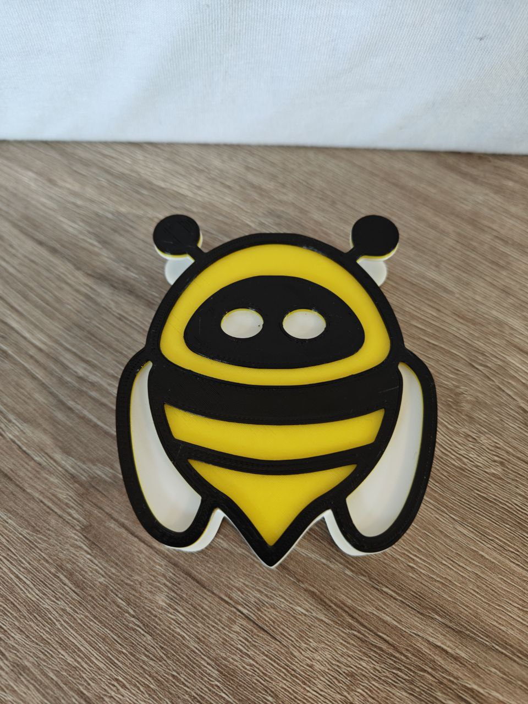
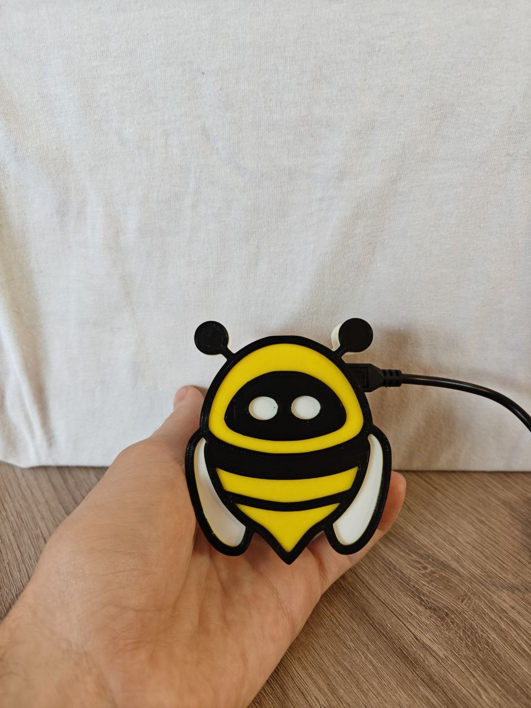
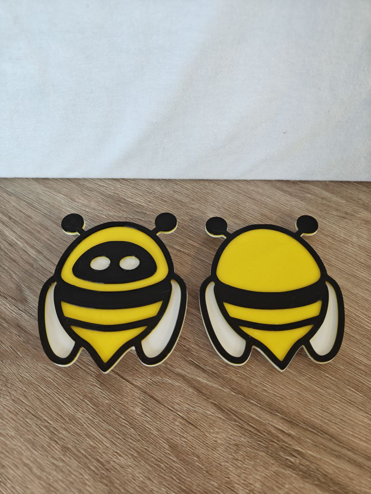
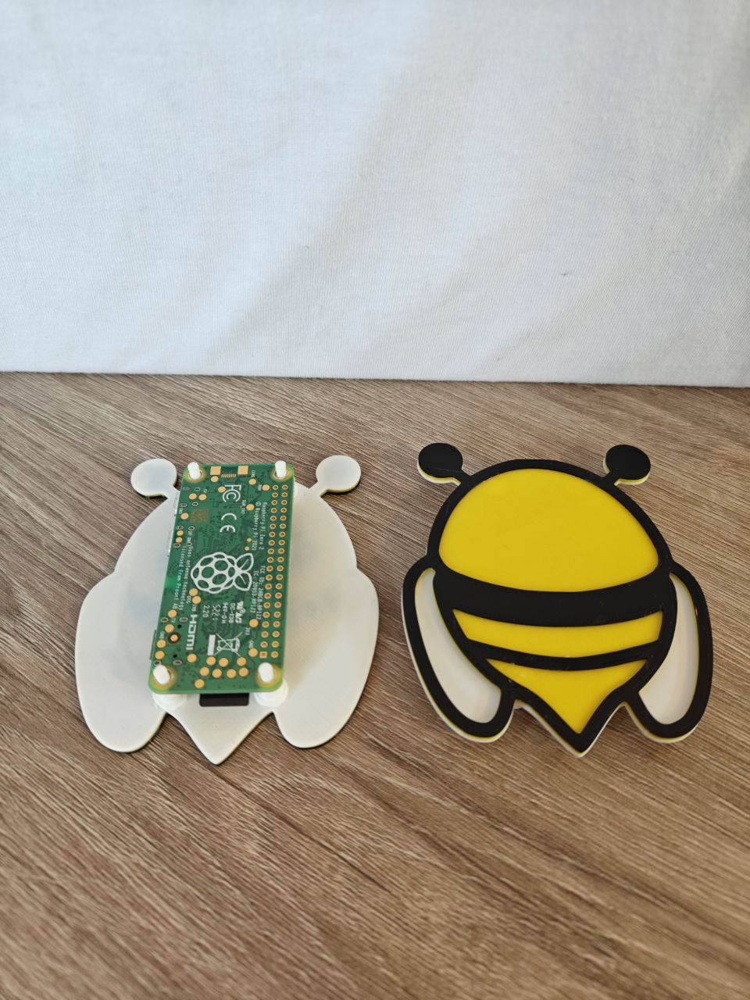
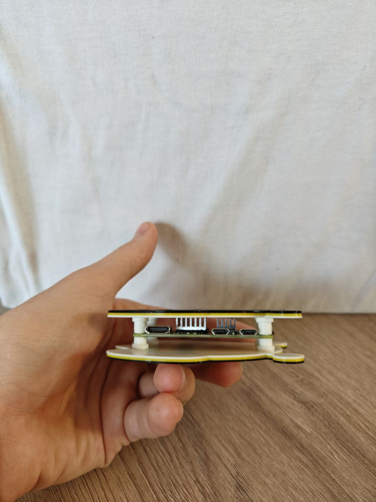
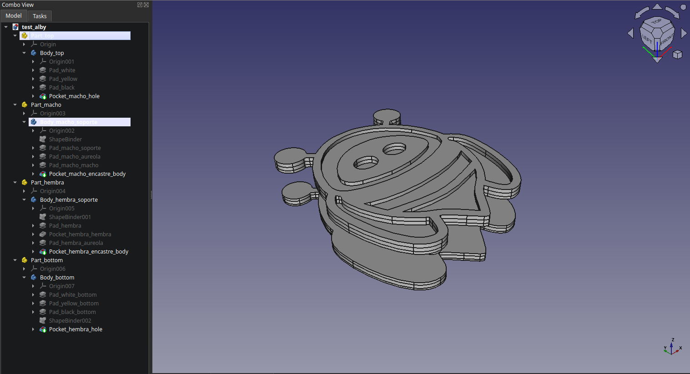
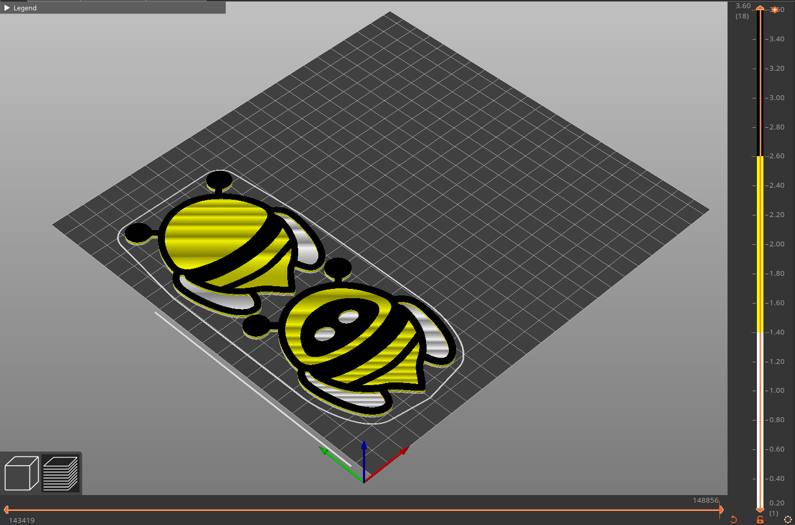

# Alby case for Raspberry Pi Zero 2W

This is a case design for a Raspberry Pi Zero 2W. This design has space for an aluminum heatsink of approximately ~8mm in height.

**Thing in Thingiverse**: [Alby case for Raspberry Pi Zero 2W](https://www.thingiverse.com/thing:6657333)

## Index

- [Files Included](#files-included)
  - [Extras](#extras)
  - [GCODE-3MF](#gcode-3mf)
  - [Parts-Assemblys](#parts-assemblys)
  - [STL](#stl)
- [Print](#print)
  - [Print](#print)
    - [Top and Bottom](#alby_case_part_bottomstl-and-alby_case_part_topstl)
      - [Printer Settings](#printer-settings)
    - [Sockets](#alby_encastre_hembrastl-and-alby_encastre_machostl)
      - [Printer Settings](#printer-settings)
- [Assembly and extras](#assembly-and-extras)
- [Creator](#creator)

## Images

  
  
  
  
  
  
  

## Files Included

### Extras

- `alby_logo_top.svg`: logo for the top case.
- `alby_logo_bottom.svg`: logo for the bottom case.

### GCODE-3MF

- `alby_case_....gcode`: `alby_case_part_top.stl` and `alby_case_part_bottom.stl` ready to print.
- `alby_case.3mf`: `alby_case_part_top.stl` and `alby_case_part_bottom.stl` with all settings ready to export o modify.
- `alby_encastres_....gcode`: x4 `alby_encastre_macho.stl` and x4 `alby_encastre_hembra.stl` ready to print.
- `alby_encastres.3mf`: `alby_encastre_macho.stl` and `alby_encastre_hembra.stl` with all settings ready to export o modify.

### Parts-Assemblys

- `alby_case_raspberry_pi_zero_2w.FCStd`: source design to modify.
- `alby_case_raspberry_pi_zero_2w.step`: all parts.
- `alby_case_part_bottom.step`: bottom part.
- `alby_case_part_top.step`: top part.
- `alby_encastre_hembra.step`: female socket.
- `alby_encastre_macho.step`: male socket.

### STLs

- `alby_case_part_bottom.stl`: bottom part, print without supports.
- `alby_case_part_top.stl`: top part, print without supports.
- `alby_case_part_hembra.stl`: female socket, print guide below.
- `alby_case_part_macho.stl`: male socket, print guide below.

## Print and Assembly Guide

### Print

Printer used: Ender 3v2.

#### `alby_case_part_bottom.stl` and `alby_case_part_top.stl`

##### Printer Settings

- Nozzle: 0.40mm
- Resolution: 0.20mm
- Infill: lightning
- Filament material: PLA
- Raft: no
- Brim: no
- Supports: no

Print pieces together and make a **layer color change** ([`M600` Marlin code](https://marlinfw.org/docs/gcode/M600.html)) at layer _7_ or _1.40mm_ and layer _13_ or _2.60mm_. Use colors in this order: white, yellow, black.

#### `alby_encastre_hembra.stl` and `alby_encastre_macho.stl`

##### Printer Settings

- Nozzle: 0.40mm
- Resolution: 0.12mm
- Infill: 100%
- Filament material: PLA
- Raft: no
- Brim: no
- Supports: Grid, Everywhere

Print x4 of each piece.

## Assembly and extras

Glue the `alby_encastre_hembra.stl` to `alby_case_part_bottom.stl` and `alby_encastre_macho.stl` to `alby_case_part_top.stl` in the holes.

## Creator

Made with :open_hands: by [Rapax](https://rapax.dev)

Tips are welcome through Lightning Zap to :zap:**rapax@lawallet.ar** or with [**Lightning QR**](https://wallet.lacrypta.ar/lnurlp/link/9ZxRDq).
