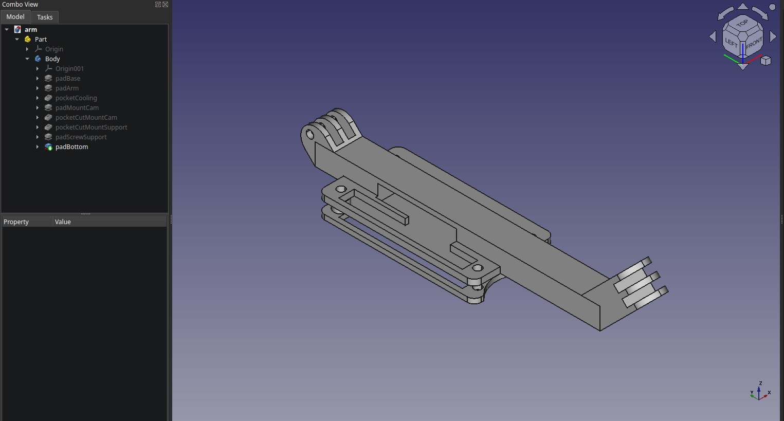

# Raspberry Pi Zero 2W Camera Arm Case [Remix]

Remix from [Pi Zero W Camera Arm Case](https://www.thingiverse.com/thing:2406863).

Changes:

- Extend arm some mm more for the bed of print dont break it.
- Inverted the position of the Raspi 180° to:
  - Have the GPIOs at the bottom to avoid future collisions with the camera
  - Be able to connect the flat cable of an OV5647 camera without having to rotate its cable
- Add space for ~8mm aluminum heatsink.

Thing in Thingiverse: [Raspberry Pi Zero 2W Camera Arm Case [Remix]](https://www.thingiverse.com/thing:6661250)

## Index

- [Files Included](#files-included)
  - [GCODE-3MF](#gcode-3mf)
  - [Images](#images)
  - [Parts-Assemblys](#parts-assemblys)
  - [STL](#stl)
- [Print](#print)
  - [Remix parts](#armstl-coverstl-and-screw_supportstl)
    - [Printer Settings](#printer-settings)
- [Creator](#creator)

## Images

  

## Files Included

### GCODE-3MF

- `raspi_camera_mount_arm_....gcode`: `arm.stl`, `cover.stl` and `screw_support.stl`.
- `raspi_camera_mount_others_....gcode`: other files from the original project (camera case and rail).
- `raspi_camera_mount.3mf`: all parts, orginal and remix.

### Parts-Assemblys

- `arm_full.FCStd`: arm, cover and screw support together.
- `arm.step`: individual part.
- `cover.step`: idem
- `screw_support.step`: idem.

### STLs

- `arm.stl`
- `cover.stl`
- `screw_support.stl`

## Print and Assembly Guide

### Print

Printer used: [Ender 3v2]

#### `arm.stl`, `cover.stl` and `screw_support.stl`

##### Printer Settings

- Nozzle: 0.40mm
- Resolution: 0.20mm
- Infill: 30%, grid
- Filament material: PLA
- Raft: no
- Brim: 2mm
- Supports: only in space of aluminum heatsink of arm

## Creator

Made with :open_hands: by [Rapax](https://rapax.dev)

Tips are welcome through Lightning Zap to :zap:**rapax@lawallet.ar** or with [**Lightning QR**](https://wallet.lacrypta.ar/lnurlp/link/9ZxRDq).
